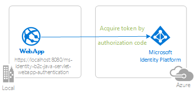

# Enable your Java Websphere web app to sign in users to your Microsoft Entra ID tenant with the Microsoft identity platform

This sample demonstrates a Java Websphere web app that signs in users to your Microsoft Entra ID tenant using the [Microsoft Authentication Library (MSAL) for Java](https://github.com/AzureAD/microsoft-authentication-library-for-java).



[!INCLUDE [scenario-sign-in-entra.md](includes/scenario-sign-in-entra.md)]

[!INCLUDE [prereqs-sign-in-entra.md](includes/prereqs-sign-in-entra.md)]
[!INCLUDE [prereqs-websphere.md](includes/prereqs-websphere.md)]

[!INCLUDE [java-servlet-overview-recommendation.md](includes/java-servlet-overview-recommendation.md)]

[!INCLUDE [enable-java-servlet-webapp-authentication-entra-id.md](includes/enable-java-servlet-webapp-authentication-entra-id.md)]


#### Deploying the Sample

These instructions assume you have installed Websphere and set up some server. You can use the guidance at [Deploy WebSphere Application Server (traditional) Cluster on Azure Virtual Machines](/azure/developer/java/ee/traditional-websphere-application-server-virtual-machines?tabs=basic) for a basic server setup. Before you can deploy to Websphere, you will need to make some configuration changes in the sample itself and (re)build the package:

1. Navigate to your app's `authentication.properties` file and change the value of `app.homePage` to your server URL and port number you are planning to use. 

```ini
# app.homePage is by default set to dev server address and app context path on the server
# for apps deployed to azure, use https://your-sub-domain.azurewebsites.net
app.homePage=https://<server-url>:<port-number>/msal4j-servlet-auth/
```

1. After saving this file, you will need to rebuild your app.

 ```
 mvn clean package
 ```

1. Once the code has build, copy the .war file over to your target server's file system. 

You will also need to make the same change in the Azure app registration, where you set it as the 'Redirect URI' in the 'Authentication' tab

1. Navigate to the Microsoft identity platform for developers [App registrations](https://go.microsoft.com/fwlink/?linkid=2083908) page. 
1. Use the search box to search for you app registration, for example `java-servlet-webapp-authentication`.
1. Open your app registration by clicking on its name. 
1. Select **Authentication** from the menu.
1. In the **Web** - **Redirect URIs** section, select **Add URI**.
1. Fill out the URI of your web app, appending **/auth/redirect**, for example `https://<server-url>:<port-number>/auth/redirect`.
1. Select **Save**. 

To deploy the sample using the Websphere's Integrated Solutions Console:

1. In the 'Applications' tab, select 'New Application', then 'New Enterprise Application'

1. Choose the .war you built, then click 'next' until you get to the 'Map context roots for Web modules' installation step (the other default settings should be fine)

1. For the context root, set it to the same value as after the port number in the 'Redirect URI' you set in sample configuration/Azure app registration, i.e. if the redirect URI is http://<server-url>:9080/msal4j-servlet-auth/ then the context root should just be 'msal4j-servlet-auth'

1. Click 'Finish', and after the application finishes installing go to the 'Websphere enterprise applications' section of the 'Applications' tab

1. Select the .war you just installed from the list of applications and click 'Start' to deploy

1. One it finishes deploying, navigate to http://<server-url>:9080/{whatever you set as the context root} and you should be able to see the application

[!INCLUDE [enable-java-servlet-webapp-authentication-entra-id-explore.md](includes/enable-java-servlet-webapp-authentication-entra-id-explore.md)]