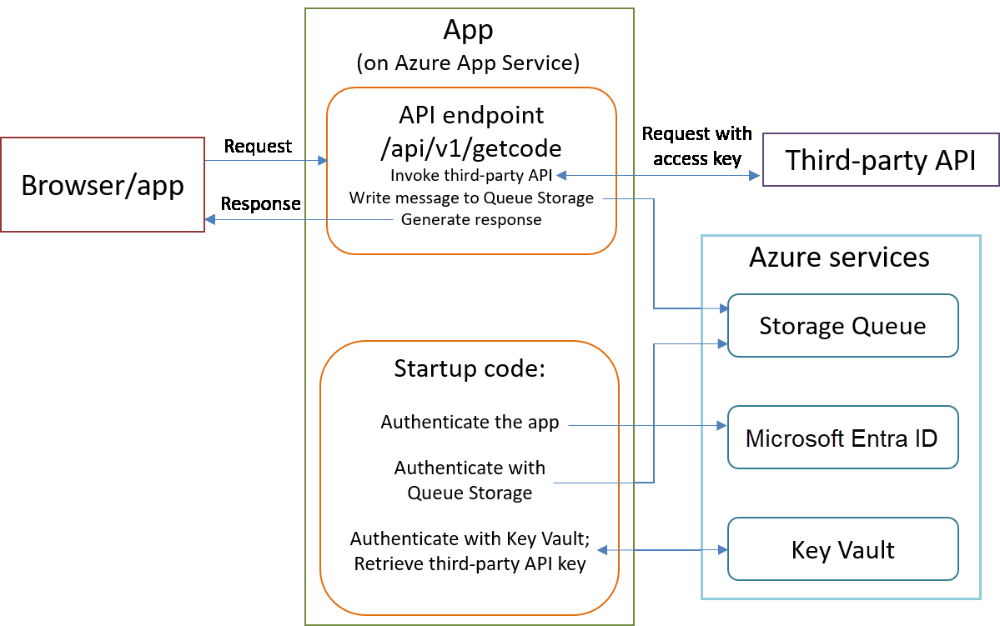

# Walkthrough: Integrated authentication for Python apps with Azure services

Microsoft Entra ID along with Azure Key Vault provide a comprehensive and convenient means for applications to authenticate with Azure services and third-party services where access keys are involved.

After providing some background, this walkthrough explains these authentication features in the context of the sample, [github.com/Azure-Samples/python-integrated-authentication](https://github.com/Azure-Samples/python-integrated-authentication).

## Part 1: Background

Although many Azure services rely solely on role-based access control for authorization, certain services control access to their respective resources by using secrets or keys. Such services include Azure Storage, databases, Cognitive Services, Key Vault, and Event Hubs.

When creating a cloud app that accesses these services, you can use the Azure portal, the Azure CLI, or Azure PowerShell to create and configure keys for your app. The keys you create are tied to specific access policies and prevent access to those app-specific resources by any other unauthorized code.

Within this general design, cloud apps must typically manage those keys and authenticate with each service individually, a process that can be both tedious and error-prone. Managing keys directly in app code also risks exposing those keys in source control and keys might be stored on unsecured developer workstations.

Fortunately, Azure provides two specific services to simplify the process and provide greater security:

- Azure Key Vault provides secure cloud-based storage for access keys (along with cryptographic keys and certificates, which aren't covered in this article). By using Key Vault, the app accesses such keys only at run time so that they never appear directly in source code.

- With Microsoft Entra managed identities, the app needs to authenticate only once with Active Directory. The app is then automatically authenticated with other Azure services, including Key Vault. As a result, your code never needs to concern itself with keys or other credentials for those Azure services. Better still, you can run the same code both locally and in the cloud with minimal configuration requirements.

This walkthrough shows how to use Microsoft Entra managed identity and Key Vault together in the same app. By using Microsoft Entra ID and Key Vault together, your app never needs to authenticate itself with individual Azure services, and can easily and securely access any keys necessary for third-party services.

> [!IMPORTANT]
> This article uses the common, generic term "key" to refer to what are stored as "secrets" in Azure Key Vault, such as an access key for a REST API. This usage should not be confused with Key Vault's management of *cryptographic* keys, which is a separate feature from Key Vault's *secrets*.

## Example cloud app scenario

To understand Azure's authentication process more deeply, consider the following scenario:

- A main app exposes a public (non-authenticated) API endpoint that responds to HTTP requests with JSON data. The example endpoint as shown in this article is implemented as a simple Flask app deployed to Azure App Service.

- To generate its response, the API invokes a third-party API that requires an access key. The app retrieves that access key from Azure Key Vault at run time.

- Before the API returns a response, it writes a message to an Azure Storage Queue for later processing. (The specific processing of these messages isn't relevant to the main scenario.)

> [!NOTE]
> Although a public API endpoint is usually protected by its own access key, for the purposes of this article we assume the endpoint is open and unauthenticated. This assumption avoids any confusion between the app's authentication needs with those of an *external* caller of this endpoint. This scenario doesn't demonstrate such an external caller.

> [!div class="nextstepaction"]
> [Part 2 - Authentication requirements >>>](walkthrough-tutorial-authentication-02.md)
