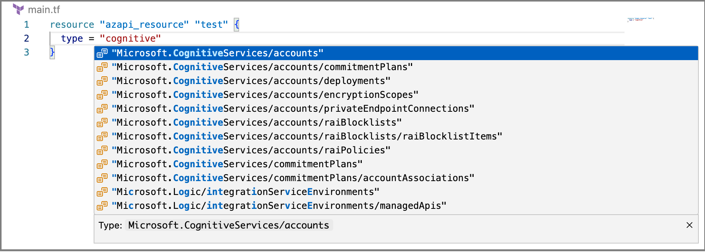
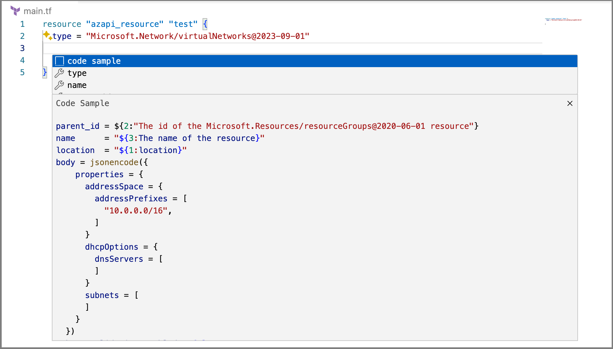

# Overview of the Terraform AzAPI provider

The AzAPI provider is a thin layer on top of the [Azure ARM REST APIs](/rest/api/resources/). It enables you to manage any Azure resource type using any API version, enabling you to utilize latest and greatest functionality within Azure. AzAPI is a first-class provider designed to be used in tandem with the AzureRM provider or even on its own.

## Resources

To allow you to manage all Azure resources and features without requiring updates, the AzAPI provider includes the following generic resources:

| Resource Name | Description |
| ------------- | ----------- |
| azapi_resource | Used to fully manage any Azure (control plane) resource (API) with full CRUD. <br> &nbsp;&nbsp;&nbsp;Example Use Cases: <br> &nbsp;&nbsp;&nbsp;&nbsp;&nbsp;&nbsp;New preview service <br>&nbsp;&nbsp;&nbsp;&nbsp;&nbsp;&nbsp;New feature added to existing service <br> &nbsp;&nbsp;&nbsp;&nbsp;&nbsp;&nbsp;Existing feature / service not currently covered |
| azapi_update_resource | Used to manage resources or parts of resources that don't have full CRUD <br> &nbsp;&nbsp;&nbsp;Example Use Cases: <br> &nbsp;&nbsp;&nbsp;&nbsp;&nbsp;&nbsp;Update new properties on an existing service <br> &nbsp;&nbsp;&nbsp;&nbsp;&nbsp;&nbsp;Update pre-created child resource - such as DNS SOA record. |
| azapi_resource_action | Used to perform a single operation on a resource without managing the lifecycle of it <br> &nbsp;&nbsp;&nbsp;Example Use Cases: <br> &nbsp;&nbsp;&nbsp;&nbsp;&nbsp;&nbsp;Shut down a Virtual Machine <br> &nbsp;&nbsp;&nbsp;&nbsp;&nbsp;&nbsp;Add a secret to a Key Vault|
| azapi_data_plane_resource | Used to manage Azure data plane resources that are ??? <br> &nbsp;&nbsp;&nbsp;Example Use Cases: <br> &nbsp;&nbsp;&nbsp;&nbsp;&nbsp;&nbsp;Resource Type 1<br> &nbsp;&nbsp;&nbsp;&nbsp;&nbsp;&nbsp;Resource Type 2 | 

## Resource configuration examples

The following code snippet configures a resource that doesn't currently exist in the AzureRM provider:

```terraform
resource "azapi_resource" "publicip" {
  type      = "Microsoft.Network/Customipprefixes@2021-03-01"
  name      = "exfullrange"
  parent_id = azurerm_resource_group.example.id
  location  = "westus2"

  body = jsonencode({
    properties = {
      cidr          = "10.0.0.0/24"
      signedMessage = "Sample Message for WAN"
    }
  })
}
```

The following code snippet configures a preview property for an existing resource from AzureRM:

```terraform
resource "azapi_update_resource" "test" {
  type        = "Microsoft.ContainerRegistry/registries@2020-11-01-preview"
  resource_id = azurerm_container_registry.acr.id

  body = jsonencode({
    properties = {
      anonymousPullEnabled = var.bool_anonymous_pull
    }
  })
}
```

The following code snippet configures a resource action on an existing AzureRM resource:

```terraform
resource "azapi_resource_action" "vm_shutdown" {
  type = "Microsoft.Compute/virtualMachines@2023-07-01"
  resource_id = azurerm_linux_virtual_machine.example.id
  action = "powerOff”
}
```

The following code snippet configures a resource that doesn't currently exist in the AzureRM provider due to being provisioned on the data plane:

```terraform
resource "azapi_data_plane_resource" "tbd" {
}
```

## Authentication using the AzAPI provider

The AzAPI provider enables the same authentication methods as the AzureRM provider. For more information on authentication options, see [Authenticate Terraform to Azure](./authenticate-to-azure.md?tabs=bash).

## Benefits of using the AzAPI provider

The AzAPI provider features the following benefits:

- Supports all Azure services:
  - Private preview services and features
  - Public preview services and features
  - All API versions
- Full Terraform state file fidelity
  - Properties and values are saved to state
- No dependency on Swagger
- Common and consistent Azure authentication
- Robust VSCode Extension

## Experience and lifecycle of the AzAPI provider

This section describes some tools to help you use the AzAPI provider.

### VS Code extension and Language Server

The [AzAPI VS Code extension](https://marketplace.visualstudio.com/items?itemName=azapi-vscode.azapi) provides a rich authoring experience with the following benefits:

- List all available resource types and API versions.

- Auto-completion of the allowed properties and values for any resource.

- Show hints when hovering over a property.

- Syntax validation

- Auto-completion with code samples.


## AzAPI2AzureRM migration tool

The AzureRM provider provides the most integrated Terraform experience for managing Azure resources. Therefore, the recommended usage of the AzAPI and AzureRM providers is as follows:

1. While the service or feature is in preview, use the AzAPI provider.
1. once the service is officially released, use the AzureRM provider.

The [AzAPI2AzureRM tool](https://github.com/Azure/azapi2azurerm/releases) is designed to help migrate from the AzAPI provider to the AzureRM provider.

AzAPI2AzureRM is an open-source tool that automates the process of converting AzAPI resources to AzureRM resources.

AzAPI2AzureRM has two modes: plan and migrate:

- Plan displays the AzAPI resources that can be migrated.
- Migrate migrates the AzAPI resources to AzureRM resources in both the HCL files and the state.

AzAPI2AzureRM ensures after migration that your Terraform configuration and state are aligned with your actual state. You can validate the state has been updated by running `terraform plan` after completing the migration to see that nothing has changed.

## Using the AzAPI provider

1. Install [VS Code extension](https://marketplace.visualstudio.com/items?itemName=azapi-vscode.azapi)
1. Add the AzAPI provider to your Terraform configuration.

    ```terraform
    terraform {
      required_providers {
        azapi = {
          source  = "Azure/azapi"
        }
      }
    }

    provider "azapi" {
      # More information on the authentication methods supported by
      # the AzureRM Provider can be found here:
      # https://registry.terraform.io/providers/hashicorp/azurerm/latest/docs

      # subscription_id = "..."
      # client_id       = "..."
      # client_secret   = "..."
      # tenant_id       = "..."
    }
    ```

1. Declare one or more AzAPI resources as shown in the following example code:

    ```terraform
    resource "azapi_resource" "example" {
      name = "example"
      parent_id = data.azurerm_machine_learning_workspace.existing.id
      type = "Microsoft.MachineLearningServices/workspaces/computes@2021-07-01"
      
      location = "eastus"
      body = jsonencode({
        properties = {
          computeType      = "ComputeInstance"
          disableLocalAuth = true
          properties = {
            vmSize = "STANDARD_NC6"
          }
        }
      })
    }
    
    ```

## Next steps

- [Deploy your first resource with the AzAPI provider](get-started-azapi-resource.md)
- [Deploy your first Update Resource with the AzAPI provider](get-started-azapi-update-resource.md)
